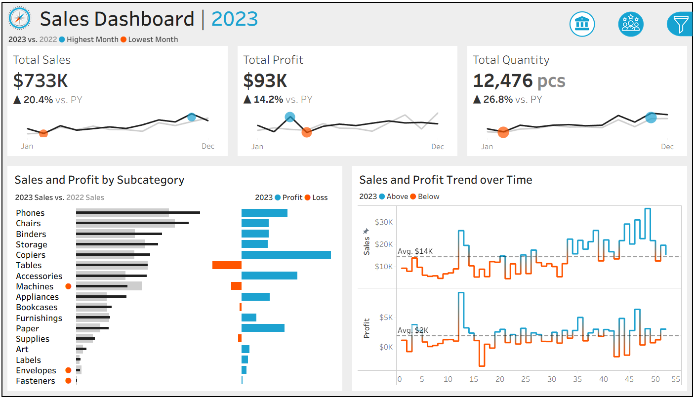

# Welcome to My Data Science Portfolio!

I’m **Gurion Ramapogu**. 

I'm a **Data Analyst** specializing in **ML**, **Deep Learning**, **LLMs**, **NLP**, **GenAI** and **Cloud MLOps**.

Cincinnati, Ohio, USA | [gurion7007@gmail.com](mailto:gurion7007@gmail.com) | [LinkedIn](https://www.linkedin.com/in/rs-gurion/) | [GitHub](https://github.com/GurionRamapoguSajeevan)

---

## Professional Summary

**Data Analyst** with **4 years of experience** driving data-informed decisions, delivering **$2M+ in annual savings**, **reducing customer churn by 25%**, and improving satisfaction by **12%.** Expert in **SQL and Python** for analysis and automation, with strong experience building **QuickSight** and **Power BI dashboards** and **translating complex datasets into actionable insights for stakeholders and executives**. Proven ability to support strategic initiatives through KPI tracking, statistical analysis, and scalable reporting solutions.

---

## Technical Skills

* _**Data Analysis & Statistics**_: Predictive Modeling, A/B Testing, Time Series Forecasting, Hypothesis Testing, Customer Segmentation
* _**Artificial Intelligence & Machine Learning**_: Supervised Learning (Random Forest, Logistic Regression, XGBoost), Unsupervised Learning (K-Means, DBSCAN, PCA), Time Series Forecasting (ARIMA, Prophet), LLMs, Natural Language Processing (NLTK, spaCy, Transformers), Deep Learning (TensorFlow, PyTorch – beginner), Anomaly Detection, Model Deployment (Flask, Streamlit), MLOps (MLflow – beginner)
* _**Programming & Databases**_: SQL (Advanced Queries, Optimization), Python (Pandas, NumPy, Scikit-learn), R, Advanced Excel
* _**Visualization & BI Tools**_: Power BI, Tableau, Looker, SSRS
* _**Big Data & Cloud Technologies**_: AWS (Redshift, Glue, S3, EMR), Snowflake, PySpark, Hadoop
* _**Project Management & Workflow**_: Agile, JIRA, Confluence, Git, GitHub, CI/CD for Analytics

---

## Professional Experience

**Data Analyst (Freelance) — Community Dreams Foundation**  
_February 2025 – February 2026_  
- Analyzed multi-year energy consumption streams using **PySpark** and **SQL**, uncovering peak demand factors and supporting forecasts that cut utility costs by **13%**.  
- Built interactive **Power BI dashboards** integrating IoT sensor data, automating anomaly alerts and saving **60%** in manual reporting workload.  
- Developed and productionized **anomaly detection** algorithms with **Scikit-learn**, identifying irregular patterns and reducing billing-related disputes by **10%**.  

**Data Analyst — Amazon**  
_June 2019 – June 2023_  
- Led deep-dive analytics on over **1M+** customer interactions using **SQL** and **Python**, uncovering root causes of service inefficiencies and delivering recommendations that **boosted resolution efficiency** by **15%** and reduced repeat contact rates.
- Engineered automated reporting pipelines with Python and **AWS Glue**, replacing manual Excel-based processes and **cutting reporting time by 70%**, enabling leaders to make real-time operational decisions.
- Designed and maintained **KPI** dashboards in **Power BI** to monitor customer satisfaction (**CSAT**), net promoter score (**NPS**), and average handle time (**AHT**), giving stakeholders self-service access to performance metrics that drove a 12% increase in customer satisfaction scores.
- Built ***predictive models** (Random Forest, Logistic Regression) in Python to forecast customer behaviour patterns, which informed proactive outreach strategies and increased first-contact resolution rates by 18%.
- Collaborated with product managers, operations, and engineering teams to translate analytical insights into action plans, achieving **$2M annual cost savings** and **reducing customer churn by 25%**.

---

## Key Projects

**GenAI-Powered Customer Review Insights & Sentiment Engine** 

[_View full project on Github_](https://github.com/GurionRamapoguSajeevan/GenAI-customer-review-sentiment-engine) | [_View Dashboard on Streamlit_](https://genai-customer-review-sentiment-engine-srj4wycgcugxaxpaxuvxtd.streamlit.app/)

| _Tech Stack: Python, Pandas, NLTK/SpaCy, Streamlit, Plotly_

* Led the entire project lifecycle for a **Voice of Customer (VoC)** solution, from data ingestion and feature engineering (text preprocessing) to insight delivery, ensuring data quality and integrity across the **analysis workflow**. The preprocessing pipeline was designed to optimize inputs for both **NLP/ML models** and subsequent analytical steps.
* Translated complex AI/ML outputs into clear, interactive business intelligence by designing and deploying a dynamic **Streamlit Dashboard** (using Plotly/Seaborn). The dashboard visualizes **sentiment trends**, **LDA-derived product themes**, and **AI-extracted pain points** for immediate executive consumption.
* Quantified business opportunities by analyzing **AI-extracted insights**, enabling product managers to rapidly prioritize improvements and successfully address over **60% of customer-identified pain points**, driving tangible improvements in Customer Experience (CX).

---

**Credit Risk Modeling ML Pipeline**

[_View full project on Github_](https://github.com/GurionRamapoguSajeevan/credit-risk-modeling-ML-pipeline) | [_Click to View and test the Streamlit Dashboard_](https://grs-credit-risk-modeling-ml-pipeline-cns3z2uh5bpbijwpcwespo.streamlit.app/)

| _Python, Pandas, NumPy, Scikit-learn, XGBoost, imbalanced-learn, SHAP, Matplotlib/Seaborn, Streamlit, DuckDB_

- Developed an end-to-end Python pipeline for **predicting loan default risk** using a 32k-record dataset, incorporating data quality checks (imputation, outlier capping), EDA with feature engineering (e.g., DTI ratio), and preprocessing (SMOTE for imbalance, StandardScaler).
- Implemented multiple modeling techniques (**Logistic Regression, Random Forest, XGBoost**), achieving **0.93 AUC-ROC** and **0.88 PR-AUC on XGBoost**; evaluated with confusion matrices and ROC/PR curves to quantify 25% false positive reduction.
- Integrated **SHAP explainability** for global feature impact (e.g., loan grade as top driver) and local instance breakdowns, ensuring auditable decisions for compliance-heavy risk scenarios.
- Deployed as an interactive Streamlit app for real-time predictions with non-technical explanations, simulating fraud/credit workflows for industries like lending and e-commerce.

---

**Customer Churn Prediction & Retention Dashboard**

[_View full project on Github_](https://github.com/GurionRamapoguSajeevan/Customer-Churn-Predictive-Analytics-Suite) | [_View Dashboard on Streamlit_](https://churnprediction-app-grs-wqyhm9zikea2uleappszlmc.streamlit.app/)

| _Python, Streamlit, XGBoost, Logistic Regression_

* Built a **Streamlit** platform for **real-time** financial and **churn analysis**, delivering **85%** prediction **accuracy** on churn and enabling investment prioritization.
* Automated churn impact evaluations, cutting analysis time from 3 hours to <1 minute, accelerating strategic planning cycles.
* Integrated **XGBoost** and **Random Forest** models with Tableau dashboards for predictive storytelling, empowering stakeholders with actionable insights.

---

**Sales & Customer Insights Dashboards: Tableau Analytics**

[_View full project on Github_](https://github.com/GurionRamapoguSajeevan/Sales_and_Customer_Insights_Dashboards_Interactive_Tableau_project) | [_Click to View and test the Dashboards_](https://public.tableau.com/app/profile/gurion.ramapogu/viz/SalesCustomerDashboards_17642103195010/SalesDashboard)

| _Tableau, Excel, SQL, Tableau Public_

* Designed and deployed two interactive **Tableau dashboards** to analyze sales and customer **KPIs**, enabling users to track **YoY performance**, **monthly trends** across 20+ metrics.
* Built dynamic **filters** to select and toggle **year**, **product categories** and **geographic regions** with cross-chart interactivity, improving data exploration **efficiency for stakeholders by an estimated 40%**.
* Developed customer analytics components such as **Top 10 Profit Customers and order distribution** modeling, helping reveal high-value segments and **behaviour patterns**.  

---

**Healthcare Data Pipeline Automation**  

| _SQL, Python (Pandas, Schedule), Tableau, Excel, Google Sheets API_

- Created automated **SQL-Python pipelines** for blood bank inventory, improving operations by 30%.  
- Developed **Tableau dashboards** to reduce stockouts by 20% via real-time tracking.  

---

## Education

**Master of Science in Data Science**  
_University at Buffalo, The State University of New York (Aug 2023 – Dec 2024)_

**Bachelor of Technology in Electronics & Communication Engineering**  
_Malla Reddy Engineering College, Telangana, India (Aug 2015 – Apr 2019)_

---

## Certifications

- **Databricks** — [Generative AI Fundamentals](https://credentials.databricks.com/593fdfdf-fc3e-445d-b606-4c61b2dbd6ed#acc.gqUFxNmD) (Jun 2025)

- **Oracle** — Oracle Cloud Infrastructure (OCI) Associate (_In progress_ : Jan 2025)

---

## Contact

📧  [gurion7007@gmail.com](mailto:gurion7007@gmail.com)  

---
📞  +1 (716) 9366-431  

---
📍 Cincinnati, Ohio, United States  

---
📄  [My Resume](https://drive.google.com/file/d/1ziErybOKBuyl9pwdgialvKRTACgIQOQu/view?usp=sharing)  

---
🔗  [LinkedIn](https://www.linkedin.com/in/rs-gurion/)  

---
🛠️  [Github](https://github.com/GurionRamapoguSajeevan)  

---
_Last updated: February 2026_
